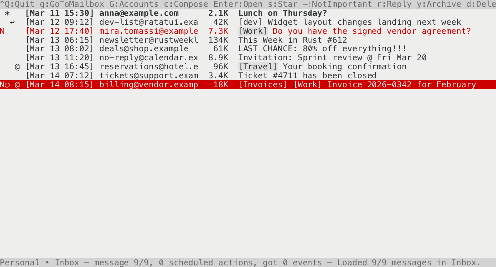

# Elma – Electronic Mail Agent

[](https://github.com/roblillack/elma/actions)
[](https://crates.io/crates/elma-tui)

Elma is a Ratatui-based terminal mail user agent. It focuses on keyboard-driven navigation and efficiency, inspired by tools like Mutt, Pine, and Elm, while
offering a modern feature set out-of-the-box.



Features include:

- Crisp HTML email rendering,
- Server-side search, spam handling, and draft management,
- Support for special-use mailboxes and labels, like starring and marking as important,
- Multiple account support,
- Attachments: an at-a-glance indicator in the message list, saving to disk, and attaching files when composing,
- Scheduled message actions (archive/delete),
- Extensibility for additional backends.

Elma strives to provide a productive and enjoyable email experience directly
from the terminal while staying compatible with the established workflows of
current web-based email services.

## Running

A “mock” backend is available via `--demo` for you to try out Elma without
setting up an email account:

```bash
cargo run -- --demo
```

Without that flag the application loads accounts from `~/.elmarc`. Multiple
accounts are supported via the `[[accounts]]` table:

```toml
[[accounts]]
name = "Private"
backend = "gmail"
email = "user@gmail.com"
password = "app-specific-password"

[[accounts]]
name = "Demo"
backend = "demo"
```

Supported backends are:

- `gmail`: Connects to Gmail via IMAP and SMTP.
- `jmap`: Connects to any JMAP-compatible server (e.g., Fastmail).
- `demo`: A mock backend that generates fake messages for demonstration
  purposes.

`type` is accepted as a spelling of `backend`, and `username` as a spelling of
`email`.

If no configuration is found the client falls back to the mock backend so you
can continue exploring the UI without network access. New mock messages arrive
every few seconds to keep the inbox active.

### JMAP accounts

A JMAP account authenticates with either a password or an API token, and reads
its session object from `url` — which defaults to Fastmail's endpoint:

```toml
[[accounts]]
name = "Fastmail"
backend = "jmap"
username = "user@fastmail.com"
# Fastmail's JMAP API takes API tokens only, not passwords. Create one under
# Settings → Privacy & Security → Manage API tokens, with the "Mail" scope.
token = "api-token"

[[accounts]]
name = "Work"
backend = "jmap"
username = "user@example.com"
# Sent as HTTP Basic, for a server that asks for a password.
password = "password"
url = "https://mail.example.com"
```

`url` may name either the session object itself or the host that serves
`/.well-known/jmap`. Should the server redirect the session fetch elsewhere, the
target host has to be listed in `redirect_hosts` for the redirect to be
followed; the host in `url` — plus Fastmail's own hosts, for a Fastmail URL — is
trusted already. Configuring both credentials uses the token.

#### Fastmail and app-specific passwords

Fastmail's app-specific passwords cover IMAP, POP, SMTP, CalDAV and CardDAV, but
**not** JMAP: its JMAP endpoints answer any Basic credential with `401 Invalid
Authorization header, not bearer`, and advertise bearer tokens as the only method
they accept. So a Fastmail account over JMAP needs an API token
(Settings → Privacy & Security → Manage API tokens), and Elma says as much at
startup rather than letting the login fail later. An app-specific password is
still the credential to use for Fastmail over IMAP — a backend Elma does not
offer yet, since `gmail` is fixed to Google's servers.

### Server certificates

The backends do not currently agree on where trust comes from. It only shows on
a server whose certificate chains to a CA that your machine knows about but the
public root list does not — a corporate TLS-inspecting proxy, or an internal CA.

- `gmail` (IMAP and SMTP) checks certificates against your operating system's
  trust store, so a CA you or your administrator installed is trusted here, and
  one the system distrusts is not.
- `jmap` checks against a copy of the Mozilla root list compiled into the binary
  and never consults the system store. A certificate from a publicly trusted CA
  works normally; an internally issued one is refused even though the rest of
  your system accepts it.

The split is not deliberate. The `jmap-client` library fixes the TLS settings it
gives its HTTP stack, and the releases that do use the system store also force a
cryptography provider that needs cmake and a C compiler to build — a build
dependency Elma does without on purpose. The two should converge once that is
resolved upstream (tracking issue: https://github.com/stalwartlabs/jmap-client/issues/34).

### Colours

Elma draws its popups — compose, the dialogs, the shortcut menus — on a surface
of their own, and which surface reads as “this window has the keys” depends on
what the terminal puts behind it. On a light terminal the focused popup is dark
and whatever it covers is light grey; on a dark terminal the focused popup is
light grey and what it covers is dark grey. Either way the box taking your
keystrokes is the one that stands out.

Which of the two the terminal is showing is worked out at startup, by asking the
terminal for its background colour (the `OSC 11` query). Terminals that do not
answer fall back to the `COLORFGBG` environment variable, and then to assuming a
dark background. Say so in `~/.elmarc` to skip the question:

```toml
# "dark", "light", or "auto" to ask the terminal. Default: auto.
theme = "light"
```

### General use

Elma presents a terminal-based email client interface with a focus on keyboard navigation and
efficiency. The main screen displays a list of emails in the selected mailbox, along with key
information such as sender, subject, and date. Users can navigate through emails, open them for
reading, and perform various actions like archiving, deleting, or starring messages.

### Acting on messages

Elma differentiates between two different types of actions on messages:

- Immediate actions: These simple actions are applied to the message right away. For example, starring or
  unstarring a message is an immediate action. Actions like these can usually easily be undone by
  performing the opposite action (e.g., unstarring a starred message) if you notice a mistake.

- Scheduled actions: These actions are marked for later application. For example, when you delete a
  message, it is marked for deletion but not removed from the list until you commit all the scheduled changes (by
  pressing `$`). This allows you to quickly go through a large amount of messages and review and modify your scheduled actions before they are finalized.

  Scheduled actions (`d`, `y`, `!`) are **idempotent**: pressing the same key on
  a message that is already scheduled for that action is a no-op — it keeps the
  action and advances to the next message. This means you can sweep through a
  list pressing `d` repeatedly without accidentally undeleting a message you
  marked earlier. To undo a scheduled action, press `u` — this removes the
  pending action, restores the message's original status, and advances to the
  next message.

### Email flags

Message status is indicated by a four symbol character prefix in the message list:

1. Read/unread/scheduled action status:
   - ` `: This is a read message
   - `N`: New/unread message
   - `D`: Scheduled for deletion
   - `A`: Scheduled for archival
   - `!`: Scheduled to move to spam
   - `I`: Scheduled to move to inbox
2. Starred/unstarred and important status:
   - ` `: Regular message
   - `*`: Starred
   - `○`: Marked as important (ASCII mode: `+`)
   - `⊛`: Marked as important and starred (ASCII mode: `#`)
3. Reply/forward state:
   - ` `: No reply/forward
   - `↩`: This message has been replied to (ASCII mode: `r`)
   - `→`: This message has been forwarded (ASCII mode: `f`)
   - `⇄`: This message has been both replied to and forwarded (ASCII mode: `x`)
4. Attachment indicator:
   - ` `: No attachment
   - `@`: Message has one or more attachments

   A part counts as an attachment when it is not body text and the message
   body cannot display it itself. An image an HTML mail references as `cid:…`
   — a signature logo, say — is part of how the message reads rather than
   something the sender attached, so it earns no marker unless the sender said
   otherwise. It is still a file: the save dialog lists it as `inline`, so an
   embedded photo can be kept like any other (see [Attachments](#attachments)).

   Before a message is opened the marker comes from what the server reports
   about its structure (the IMAP `BODYSTRUCTURE`, JMAP's `hasAttachment`).
   Opening, replying to, or forwarding a message parses the real MIME tree and
   corrects the marker in the list if the two disagree.

### Key bindings

- `Ctrl+Q` quits to the shell.
- `Enter`/`Right` opens the selected message; `Esc`/`Left` closes the viewer.
- `d`, `Delete`, or `Backspace` schedule the message for deletion.
- `y` schedules the message for archival.
- `!` schedules the message to move to spam.
- `u` unschedules a pending action (delete/archive/spam/move-to-inbox), or toggles unread/read state on normal messages.
- `s` toggles the star flag. In the message list `S` does the same; in the
  message viewer `S` opens the _Save attachment_ dialog instead (see
  [Attachments](#attachments)).
- `c` composes a new message; `r` replies, `a` replies to all, and `f` forwards
  the selected or open message.
- `$` commits scheduled actions (removing archived/deleted messages from the list).
- Arrow keys, `PageUp`/`PageDown`, `Home`, `End` move the cursor in the inbox.
- While a message is open, `j` / `k` jump to the next/previous message and `.` toggles raw HTML.
- `g` go to mailbox:
  - `i` Inbox
  - `a` Archive
  - `s` Starred
  - `I` Important
  - `d` Drafts
  - `t` Sent
  - `S` Spam (Should be `j` or even `!`?)
  - `T` Trash (Should be `g` `r` or even `g` `#`?)

When viewing a special mailbox (Archive, Spam, Trash), the primary action key for that mailbox is flipped: `d` in Trash, `y` in Archive, and `!` in Spam each schedule a move back to inbox instead. Pressing `u` then unstages that move, keeping the message where it is.

### Attachments

Messages that carry attachments are marked with `@` in the message list (see
[Email flags](#email-flags)); opening one lists them above the body with their
type and size.

**Saving.** `S` in the message viewer opens the _Save attachment_ dialog.
`Tab` switches between the attachment list and the target folder, `Up`/`Down`
pick an attachment, and `Enter` writes it. Images the body embeds are listed
too, marked `inline` — the message list ignores them, but a photo sent that way
(Apple Mail does this routinely) is still a file you can keep. The folder defaults to
`$XDG_DOWNLOAD_DIR` (falling back to `~/Downloads`), `~` is expanded, and an
existing file is never overwritten — Elma appends ` (1)`, ` (2)`, … instead.
Backends that hand out attachment bodies on demand (JMAP) download in the
background, so the dialog stays responsive; `Esc` closes it and cancels the
save before anything is written.

**Attaching.** In the compose view, `Tab` to the _Attach_ button and press
`Enter` (or `a`) to get a path prompt; `~` and shell-style escapes are
understood. Dropping files onto the terminal works too — Elma treats a paste
as a file drop when every item in it is an absolute path that exists, and as
ordinary text otherwise. With one or more files attached, the attachment list
becomes a focus stop of its own: `Up`/`Down` select, `Delete`/`Backspace`
removes. Sending and saving a draft run in the background, so a large upload
does not freeze the UI; compose stays open and read-only until the backend has
accepted the message.

A file of 10 MiB or more is not attached until you say so: Elma names it, says
what it would do to the message, and takes `Enter`/`y` or `Esc`/`n`. The rest of
a multi-file drop waits its turn and continues once the question is answered.
The attachment list header carries the running message size — attachments are
base64-encoded on the wire, so it counts the encoded figure, which is the one a
provider measures against its limit (25 MB for Gmail).

Forwarding a message or reopening a draft keeps the original attachments;
anything that cannot be recovered is reported in the status line rather than
silently dropped. Replying does not — a reply carries the quoted text, not the
files that came with it. Inline images stay behind on a forward as well: the
quoted body no longer references them, so carrying them over would attach a
signature logo to every forwarded newsletter.

## Development

`cargo test` runs the unit tests and the snapshot tests together.

### Snapshot tests

Every major view — message list, viewer, composer, search, the loading
overlay, the mailbox and account choosers, the save-attachment dialog — is
covered by a snapshot test that drives the real application through synthetic
key events and renders the resulting terminal to SVG. The tests live in
`src/snapshot_tests.rs`, the harness that runs them in `src/test_harness.rs`,
and the frames themselves in `src/snapshots/*.snap.svg` — open one in a browser
to see exactly what the client drew, colours and all.

Each view is snapshotted twice, as `<view>-dark.snap.svg` and
`<view>-light.snap.svg`, in the classic **Tango Dark** and **Tango Light** the
Ubuntu-era GNOME Terminal shipped and most emulators copied. The pair differs
only in the two colours the terminal supplies rather than Elma — Tango Light is
`#2e3436` text on `#eeeeec`, Tango Dark the same two the other way round — and
uses one and the same 16-colour Tango palette, which is how the scheme is
defined. Anything Elma colours itself is therefore identical in both frames,
and the pair shows at a glance which of those choices stop working when the
terminal is not the one you happen to use.

Nothing in a frame comes from the machine it was taken on: the mail comes from
a fixture backend rather than the randomised mock one, and the clock the views
read (`src/clock.rs`) is frozen for the duration of a test, so the dates in the
message list and the seconds next to a throbber are the same on every run.

A change to the UI therefore shows up as a changed frame. Review the difference
with

```bash
cargo insta review        # cargo install cargo-insta
```

which shows each changed snapshot and writes back the ones you accept, or set
`INSTA_UPDATE=always` to take the new frames unseen.

### The demo GIF

The animation at the top of this file is recorded through the same harness, by
a script that presses keys: triage a morning's mail and commit the scheduled
actions, open the invoice that is left and save its PDF, then answer the
colleague who asked for a document with that document attached, archive her
message and commit that too. The story is `examples/demo/main.rs`, the mail it
works through `examples/demo/mailbox.rs`, and the camera that rasterises the
SVG frames into a GIF `examples/demo/recorder.rs` — which is also where the
recorded terminal theme is chosen. Re-record it with

```bash
cargo run --release --example demo --features recorder
```

Because it is the real client throughout — real event handling, real rendering,
real backend threads — the recording cannot drift away from what Elma does; a
changed view simply shows up in the next take. Set `ELMA_DEMO_FRAMES=<dir>` to
also dump every frame as a PNG while working on the script.
